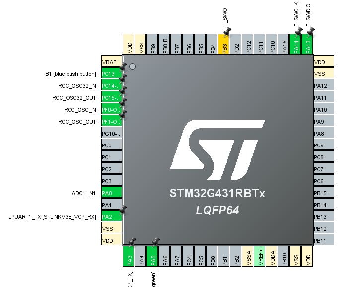

# Neprekinjena ADC pretvorba

1. Cilj naloge: S pomočjo programskega okolja STM32CubeIDE in HAL knjižnicami sprogramirajte mikroprocesor tako, da bo izvajal neprekinjene ADC        pretvorbe z izbranim potenciometrom. Takšna pretvorba je primerna za hitro in nenehno branje vhodne vrednosti.  
2. Postopek inicializacije periferije
   - Uporabljena razvojna plošča je **NUCELO-G431RB**.
   - Izbran pin je **PA0** na plošči je to **A0**.  
   - Poleg pina se izpiše **ADC1_IN1**.
   - Opazimo da se spreminjajo toudi druge stvari npr. HCLK je zdaj **64 MHz** namesto **170 MHz**.  
   - $f$ preskalirana = **16Mhz**.
   - $t_{vz}$ = 259.5/16 Mhz = 16.84 ms.

## Pinout

## Potenciometra na razširitveni ploščici

## Komentar

Pri kodi je bil manjši problem z debug funkcijo. Problem pa se je rešil z ponovnim zagonm.
